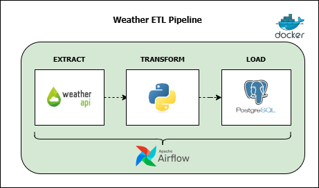
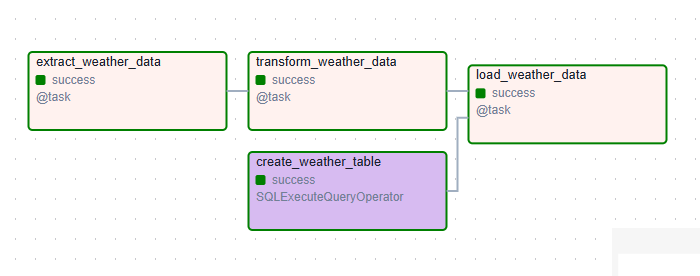

# Weather ETL Pipeline

An Apache Airflow ETL pipeline that extracts weather forecast data from the [WeatherAPI](https://www.weatherapi.com/), transforms it into a structured format, and loads it into a PostgreSQL database.



## Project Structure

```
weather-etl/
├── .astro/                              # Astronomer CLI configuration
├── assets/
│   └── pipeline-diagram.png             # Pipeline architecture diagram
├── dags/
│   ├── etl.py                           # Main DAG definition
│   └── sql/
│       └── weather_table_ddl.sql        # Table DDL
├── include/                             # Additional files
├── plugins/                             # Custom Airflow plugins
├── tests/                               # Unit tests
├── .env                                 # Environment variables (API key)
├── .gitignore
├── airflow_settings.yaml                # Airflow local settings
├── Dockerfile                           # Docker image definition
├── packages.txt                         # System-level dependencies
└── requirements.txt                     # Python dependencies
```

## DAG in Airflow UI



## Workflow

The DAG follows this task execution order:

```
extract_weather_data >> transform_weather_data >> create_weather_table >> load_weather_data
```

### 1. Extract Weather Data

Makes an HTTP GET request to the WeatherAPI forecast endpoint for Recife, Brazil. The task fetches a 1-day forecast including location details, current conditions, and daily forecasts.

### 2. Transform Weather Data

Parses the JSON response from the API and extracts 12 key fields into a structured format. The following fields are extracted:

| Field | Description |
|-------|-------------|
| `name` | Location name |
| `region` | Region or state |
| `country` | Country |
| `tz_id` | Timezone identifier |
| `localtime` | Local date and time |
| `date` | Forecast date |
| `last_updated` | Last update timestamp |
| `condition` | Weather condition text |
| `maxtemp_c` | Maximum temperature (°C) |
| `mintemp_c` | Minimum temperature (°C) |
| `avgtemp_c` | Average temperature (°C) |
| `chance_of_rain` | Daily chance of rain (%) |

### 3. Create Weather Table

Executes the DDL statement to create the `weather_data` table if it does not already exist.

### 4. Load Weather Data

Inserts the transformed data into the PostgreSQL `weather_data` table using Airflow's `PostgresHook`. If a record with the same `(name, date)` already exists, the existing row is updated instead of inserting a duplicate.

## API Description

This project uses the [WeatherAPI](https://www.weatherapi.com/) free tier. The WeatherAPI provides:

- Real-time weather data
- Weather forecasts up to 14 days
- Historical weather data
- Astronomy data (sunrise, sunset, moonrise, moonset)
- Time zone information

**Endpoint used:** `forecast.json` - Returns a forecast for the specified location and number of days.

**Parameters used:**
- `q`: Location query (Recife, Brazil)
- `days`: Number of forecast days (1)
- `alerts`, `aqi`, `pollen`, `tides`: Disabled for this use case

## Database Schema

The `weather_data` table is created automatically by the `create_weather_table` task using the DDL in `dags/sql/weather_table_ddl.sql`.

## Output

Data is loaded into the `weather_data` table in the PostgreSQL database (`postgres_default` connection). Each DAG run inserts a new row with the forecast data for Recife.

## Idempotency

The DAG is designed to be **idempotent**: running the same DAG multiple times for the same date **does not generate duplicate data**.

This is guaranteed by two layers:

1. **`UNIQUE (name, "date")` constraint** on the `weather_data` table — prevents two rows with the same city and date combination from existing in the table.
2. **`ON CONFLICT DO UPDATE`** in `PostgresHook.insert_rows()` — when a row with the same `(name, date)` already exists, the other fields are updated instead of inserting a duplicate.

> **Example:** If the DAG runs twice on the same day for the same city, only one row will be kept in the table with the most recent data from the API.

## DAG Schedule

The DAG runs **daily at 6:00 AM** (cron: `0 6 * * *`).

## Error Handling

Each task includes try-except blocks to handle:

- **Extract**: HTTP errors, connection failures, timeouts
- **Transform**: Missing or malformed data
- **Create Table**: SQL execution errors
- **Load**: Database connection errors, constraint violations

## Dependencies

| Package | Version |
|---------|---------|
| requests | 2.34.2 |
| psycopg2-binary | 2.9.10 |
| ruff | >=0.15.14 |

## Airflow Connection

The DAG uses a PostgreSQL connection with ID `postgres_default`. Configure it in `airflow_settings.yaml`:

```yaml
airflow:
  connections:
    - conn_id: postgres_default
      conn_type: postgres
      conn_host: postgres
      conn_schema: postgres
      conn_login: postgres
      conn_password: postgres
      conn_port: 5432
```

> The `postgres` host refers to the PostgreSQL container included by default in the Astro Runtime.

## Prerequisites

- [Docker](https://www.docker.com/) installed
- [Astronomer CLI](https://www.astronomer.io/docs/astro/cli/install-cli) installed
- A free API key from [WeatherAPI](https://www.weatherapi.com/)

## Installation & Setup

1. **Clone the repository:**

   ```bash
   git clone <repository-url>
   cd weather-etl
   ```

2. **Set up the API key:**

   Create a `.env` file in the project root:

   ```
   api_key=YOUR_WEATHERAPI_KEY
   ```

3. **Start the Airflow environment:**

   ```bash
   astro dev start
   ```

4. **Access the Airflow UI:**

   Open [http://localhost:8080](http://localhost:8080) in your browser (credentials: `admin` / `admin`).
